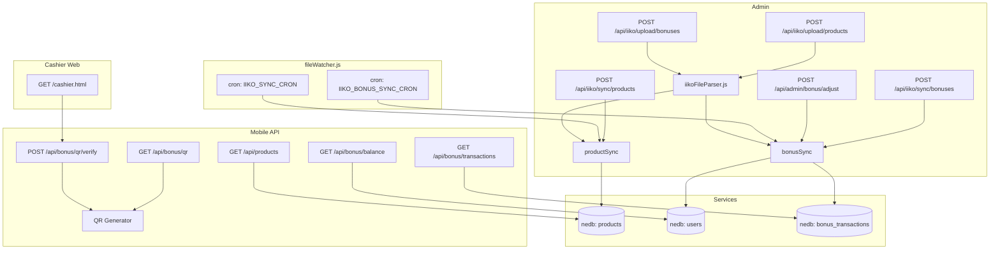

# Design Document: iiko File Integration

## Overview

Интеграция бэкенда Satory Tea (Node.js + Express + nedb-promises) с системой iiko через файловые выгрузки Excel/CSV — без использования платного REST API. Система принимает файлы через HTTP-эндпоинты или сканирует папку по расписанию, парсит их, выполняет upsert в nedb и предоставляет мобильному приложению (React Native / Expo) актуальные данные о товарах и бонусных балансах гостей.

Дополнительно реализуется QR-идентификация гостя на кассе с HMAC-подписью и TTL 5 минут, а также ручная корректировка бонусного баланса администратором.

Существующий роут `/api/iiko/sync` сохраняет обратную совместимость — переориентируется с REST API iiko на файловый парсинг.

## Architecture



Ключевые архитектурные решения:

- **Изолированный парсер** (`iikoFileParser.js`) — чистые функции без side-эффектов, легко тестируются независимо от Express.
- **Два роута** вместо одного: `routes/iiko.js` (загрузка/синхронизация/статус) и `routes/bonus.js` (баланс, транзакции, QR). Это сохраняет существующий `routes/iiko.js` и не ломает `server.js`.
- **nedb-promises** — уже используется в проекте, новые коллекции добавляются в `db.js`.
- **multer** — для приёма multipart/form-data файлов.
- **node-cron** — для расписания автосинхронизации.
- **crypto** (встроенный Node.js) — для HMAC-SHA256 подписи QR.

## Components and Interfaces

### backend/services/iikoFileParser.js

```js
// Парсит файл товаров iiko → массив объектов
parseProductsFile(filePath: string): Promise<ProductRow[]>

// Парсит файл журнала бонусных операций iikoCard → массив объектов
parseBonusesFile(filePath: string): Promise<BonusRow[]>
```

Внутри использует `xlsx` (npm) для чтения .xlsx/.xls/.csv в единый формат. Маппинг колонок — case-insensitive trim.

### backend/services/fileWatcher.js

```js
// Инициализирует cron-задачи из переменных окружения
initWatcher(): void
```

Использует `node-cron`. При ошибке логирует с префиксом `[iiko-cron]` и не падает.

### backend/routes/iiko.js (обновлённый)

| Метод | Путь | Защита | Описание |
|-------|------|--------|----------|
| POST | /api/iiko/upload/products | x-admin-secret | Загрузка файла товаров |
| POST | /api/iiko/upload/bonuses | x-admin-secret | Загрузка файла бонусов |
| POST | /api/iiko/sync/products | x-admin-secret | Ручной запуск Product_Sync |
| POST | /api/iiko/sync/bonuses | x-admin-secret | Ручной запуск Bonus_Sync |
| POST | /api/iiko/sync | — | Обратная совместимость |
| GET | /api/iiko/status | — | Статус синхронизации |

### backend/routes/bonus.js (новый)

| Метод | Путь | Защита | Описание |
|-------|------|--------|----------|
| GET | /api/bonus/balance | JWT | Баланс + история + loyalty_status |
| GET | /api/bonus/transactions | JWT | Полная история транзакций |
| GET | /api/bonus/qr | JWT | Генерация QR-кода |
| POST | /api/bonus/qr/verify | открытый | Верификация QR (для кассы) |

### backend/routes/admin.js (новый)

| Метод | Путь | Защита | Описание |
|-------|------|--------|----------|
| POST | /api/admin/bonus/adjust | x-admin-secret | Ручная корректировка баланса |

### backend/public/cashier.html

Статическая HTML-страница с `html5-qrcode` сканером. Отправляет отсканированный QR на `POST /api/bonus/qr/verify` и отображает имя и телефон гостя.

### mobile/app/qr.tsx (новый экран)

- Запрашивает `GET /api/bonus/qr` при монтировании
- Отображает QR через `react-native-qrcode-svg`
- Таймер обратного отсчёта 5 минут
- Кнопка "Обновить QR"
- Имя пользователя и последние 4 цифры телефона под QR

## Data Models

### nedb: products (обновлённая схема)

```js
{
  _id: string,           // nedb auto
  iiko_id: string,       // ключ upsert (ранее: iiko_id)
  name: string,
  category: string,
  description: string,
  price: number,         // целое, рубли
  stock: number | null,  // float или null
  unit: string,
  // Поля, сохраняемые при upsert (не перезаписываются):
  rating: number,
  reviews_count: number,
  badge: string | null,
  year: number | null,
  // Служебные:
  active: boolean,       // false = мягкое удаление
  updated_at: string,    // ISO 8601
}
```

### nedb: users (добавляемые поля)

```js
{
  // ... существующие поля ...
  bonus_balance: number | null,   // актуальный бонусный баланс
  loyalty_status: string,         // 'Бронза' | 'Серебро' | 'Золото'
  bonus_updated_at: string | null // ISO 8601, время последнего обновления баланса
}
```

### nedb: bonus_transactions (новая коллекция)

```js
{
  _id: string,
  user_id: string | null,      // _id из users (null если не найден)
  phone: string,               // нормализованный +7XXXXXXXXXX
  guest_name: string,
  date: string,                // ISO 8601
  operation_type: string,      // из файла или 'manual_accrual' / 'manual_deduction'
  accrued: number,
  spent: number,
  balance: number,
  description: string,
  created_at: string           // ISO 8601
}
```

### QR_Payload (JSON в строке qr_data)

```js
{
  userId: string,
  phone: string,
  timestamp: number,   // Unix seconds
  signature: string    // HMAC-SHA256(QR_SECRET, "userId:phone:timestamp")
}
```

### Delta (ответ синхронизации)

```js
// Product_Sync
{ added: number, updated: number, skipped: number, total: number, synced_at: string }

// Bonus_Sync
{ matched: number, unmatched: number, total: number, synced_at: string }
```

### Loyalty Status Rules

```
0–499   → 'Бронза'
500–999 → 'Серебро'
1000+   → 'Золото'
```

## Correctness Properties

*A property is a characteristic or behavior that should hold true across all valid executions of a system — essentially, a formal statement about what the system should do. Properties serve as the bridge between human-readable specifications and machine-verifiable correctness guarantees.*

### Property 1: Валидация расширения файла

*For any* файла, загружаемого через `/api/iiko/upload/*`, если расширение не входит в множество {.xlsx, .xls, .csv}, сервер должен вернуть HTTP 400; если входит — принять файл (HTTP 200/201).

**Validates: Requirements 1.1, 1.3, 4.1**

---

### Property 2: Сохранение файла под стандартным именем

*For any* успешно загруженного файла товаров, в директории Upload_Dir должен существовать файл `products_latest.<ext>` с тем же содержимым.

**Validates: Requirements 1.2**

---

### Property 3: Структура объекта товара после парсинга

*For any* валидной строки файла товаров (содержащей Наименование и Код), `parseProductsFile` должна возвращать объект, содержащий ненулевые поля `iiko_id`, `name`, `price`, а также поля `category`, `stock`, `description`, `unit`.

**Validates: Requirements 2.2, 2.6, 7.2**

---

### Property 4: Цена — целое число

*For any* строки файла товаров с числовым значением в колонке Цена, поле `price` в результате парсинга должно быть целым числом (Math.round применён).

**Validates: Requirements 2.4**

---

### Property 5: Upsert товаров по iiko_id (round-trip)

*For any* набора товаров из файла, после выполнения Product_Sync каждый товар должен быть доступен в nedb по запросу `{ iiko_id }` с актуальными полями `name`, `price`, `category`.

**Validates: Requirements 3.1**

---

### Property 6: Сохранение пользовательских полей при upsert

*For any* существующего товара с заполненными полями `rating`, `reviews_count`, `badge`, `year`, после Product_Sync эти поля должны сохранять свои значения (не перезаписываться данными из файла).

**Validates: Requirements 3.3**

---

### Property 7: Мягкое удаление отсутствующих товаров

*For any* товара в nedb с `iiko_id`, которого нет в текущем файле выгрузки, после Product_Sync поле `active` этого товара должно быть `false`.

**Validates: Requirements 3.5**

---

### Property 8: Нормализация телефона

*For any* строки с номером телефона в форматах `8XXXXXXXXXX`, `+7XXXXXXXXXX`, `7XXXXXXXXXX`, `8 (XXX) XXX-XX-XX` и их вариациях, функция нормализации должна возвращать строку вида `+7XXXXXXXXXX` (11 цифр после +7).

**Validates: Requirements 4.4**

---

### Property 9: Обновление bonus_balance по телефону (round-trip)

*For any* пользователя в nedb с нормализованным `phone`, совпадающим с записью в файле бонусов, после Bonus_Sync поле `bonus_balance` пользователя должно равняться последнему по дате значению `balance` из файла.

**Validates: Requirements 4.5**

---

### Property 10: Сохранение всех строк бонусного журнала

*For any* файла бонусных операций с N валидными строками (содержащими Телефон), после Bonus_Sync коллекция `bonus_transactions` должна содержать не менее N новых записей с соответствующими `phone` и `balance`.

**Validates: Requirements 4.7**

---

### Property 11: Расчёт loyalty_status

*For any* значения `bonus_balance`: если 0–499 → `loyalty_status = 'Бронза'`; если 500–999 → `'Серебро'`; если ≥ 1000 → `'Золото'`. Это правило должно применяться одинаково в Bonus_Sync и в `/api/admin/bonus/adjust`.

**Validates: Requirements 9.6, 11.5**

---

### Property 12: История транзакций — не более 10 записей в ответе balance

*For any* пользователя с более чем 10 записями в `bonus_transactions`, эндпоинт `GET /api/bonus/balance` должен возвращать в поле `history` ровно 10 последних записей (по `date` desc).

**Validates: Requirements 9.5**

---

### Property 13: Структура и подпись QR_Payload

*For any* сгенерированного QR через `GET /api/bonus/qr`, декодированный JSON должен содержать поля `userId`, `phone`, `timestamp`, `signature`, где `signature` верифицируется как HMAC-SHA256(`QR_SECRET`, `"userId:phone:timestamp"`).

**Validates: Requirements 10.2**

---

### Property 14: TTL QR-кода

*For any* QR_Payload, где `Date.now()/1000 - timestamp > 300`, эндпоинт `POST /api/bonus/qr/verify` должен возвращать `{ valid: false }`.

**Validates: Requirements 10.3**

---

### Property 15: Корректность ручной корректировки баланса

*For any* пользователя с текущим `bonus_balance = B` и запроса `POST /api/admin/bonus/adjust` с `delta = D`:
- если D > 0: новый баланс = B + D
- если D < 0: новый баланс = max(0, B + D)
- в обоих случаях `loyalty_status` пересчитывается по правилам Property 11

**Validates: Requirements 11.2, 11.3, 11.5**

---

## Error Handling

| Ситуация | HTTP | Ответ |
|----------|------|-------|
| Неверное расширение файла | 400 | `{ error: "Допустимые форматы: .xlsx, .xls, .csv" }` |
| Файл > 10 МБ | 413 | `{ error: "Файл превышает 10 МБ" }` |
| Файл не найден при sync | 404 | `{ error: "Файл выгрузки не найден. Загрузите файл через POST /api/iiko/upload/products" }` |
| Повреждённый файл | 422 | `{ error: "<описательное сообщение от парсера>" }` |
| Пользователь не найден (adjust) | 404 | `{ error: "Пользователь с телефоном <phone> не найден" }` |
| Неверный/просроченный QR | 200 | `{ valid: false, reason: "expired" \| "invalid_signature" }` |
| Ошибка cron-задачи | — | Лог в stdout с префиксом `[iiko-cron]`, процесс продолжает работу |

Парсер (`iikoFileParser.js`) при повреждённом файле **выбрасывает** ошибку с описательным сообщением — не возвращает пустой массив молча. Роут оборачивает вызов в try/catch и возвращает HTTP 422.

Строки без обязательных полей (Наименование+Код для товаров, Телефон для бонусов) пропускаются с увеличением счётчика `skipped`/`unmatched` — это не ошибка, а нормальный режим работы.

## Testing Strategy

### Подход

Используется двойная стратегия: **unit-тесты** для конкретных примеров и граничных случаев + **property-based тесты** для универсальных свойств.

- **Unit-тесты**: Jest (`npm install --save-dev jest`)
- **Property-based тесты**: fast-check (`npm install --save-dev fast-check`)
- Минимум **100 итераций** на каждый property-тест (fast-check по умолчанию: 100)

### Структура тестов

```
backend/
  __tests__/
    iikoFileParser.unit.test.js   — unit-тесты парсера
    iikoFileParser.prop.test.js   — property-тесты парсера
    bonusSync.prop.test.js        — property-тесты Bonus_Sync
    productSync.prop.test.js      — property-тесты Product_Sync
    qr.prop.test.js               — property-тесты QR
    admin.prop.test.js            — property-тесты admin adjust
```

### Property-тесты (fast-check)

Каждый тест помечен комментарием:
`// Feature: iiko-file-integration, Property N: <текст свойства>`

| Property | Тест | Генераторы |
|----------|------|------------|
| P1: Валидация расширения | `fc.string()` → случайные расширения | invalid ext → 400, valid ext → не 400 |
| P3: Структура объекта товара | `fc.record({ name, code, price, ... })` → синтетический xlsx | output содержит все поля |
| P4: Цена — целое | `fc.float()` → price | `Number.isInteger(result.price)` |
| P5: Upsert round-trip | `fc.array(productRecord)` | findOne по iiko_id возвращает актуальные данные |
| P6: Сохранение rating/badge | `fc.record({ rating, badge, ... })` | поля не изменились после upsert |
| P7: Мягкое удаление | `fc.array(iiko_id)` → подмножество в файле | остальные имеют active=false |
| P8: Нормализация телефона | `fc.oneof(formats)` | результат `/^\+7\d{10}$/` |
| P9: bonus_balance round-trip | `fc.array(bonusRow)` | balance пользователя = max по дате |
| P10: Сохранение транзакций | `fc.array(bonusRow, { minLength: 1 })` | count(bonus_transactions) >= N |
| P11: loyalty_status | `fc.integer({ min: 0, max: 5000 })` | правильный статус по диапазону |
| P12: История ≤ 10 | `fc.array(tx, { minLength: 11 })` | history.length === 10 |
| P13: QR подпись | `fc.record({ userId, phone })` | HMAC верифицируется |
| P14: QR TTL | `fc.integer({ min: 301 })` → age | valid === false |
| P15: Admin adjust | `fc.integer(), fc.integer()` → balance, delta | корректный новый баланс |

### Unit-тесты

- Загрузка файла с неверным расширением → HTTP 400
- Загрузка файла > 10 МБ → HTTP 413
- `POST /api/iiko/sync` при отсутствии файла → HTTP 404 с нужным сообщением
- `GET /api/iiko/status` содержит поля `connected`, `configured` (обратная совместимость)
- `parseProductsFile` на повреждённом файле → throws с непустым message
- `parseBonusesFile` на повреждённом файле → throws с непустым message
- `GET /api/bonus/balance` без JWT → HTTP 401
- `POST /api/admin/bonus/adjust` с несуществующим phone → HTTP 404
- `POST /api/bonus/qr/verify` с валидным QR → `{ valid: true, userId, phone }`

### Новые зависимости

```bash
# backend
npm install multer xlsx node-cron
npm install --save-dev jest fast-check

# mobile
npx expo install react-native-qrcode-svg
```
